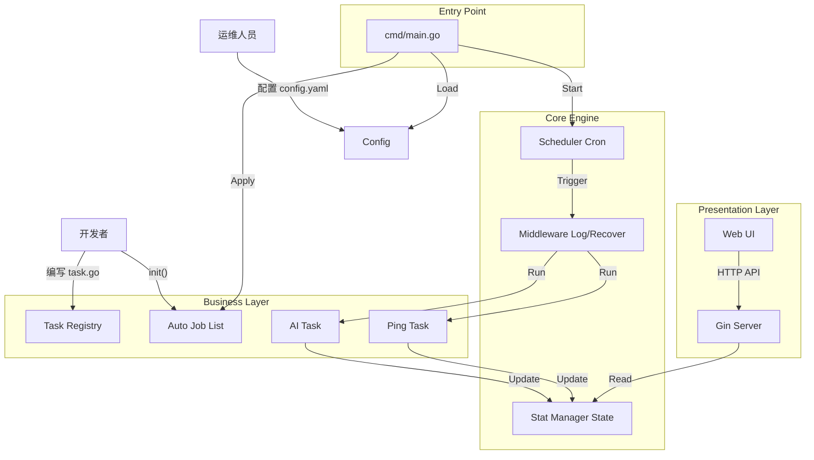

# Go-Task: Enterprise-Grade Extensible Scheduler

Go-Task 是一个基于 Golang 开发的高性能、模块化、可观测的分布式定时任务调度平台。

它采用了**整洁架构 (Clean Architecture)** 设计理念，打破了传统 Crontab 脚本难以管理、难以监控的痛点。支持 **YAML 配置驱动**和**代码自注册**双重模式，内置 Web 管理面板，能够轻松实现 AI 内容生成、DevOps 自动化运维、系统监控等多种业务场景。

---

## 📋 目录

- [设计思路](#设计思路-design-philosophy)
- [架构与调用关系](#架构与调用关系-architecture)
- [核心模型](#核心模型-core-models)
- [客户端与监控](#客户端与监控-clients--observability)
- [使用方法](#使用方法-usage-guide)
- [快速开始](#快速开始-quick-start)
- [项目结构](#项目结构-project-layout)

---

## 🎯 设计思路 (Design Philosophy)

本项目的设计核心遵循 **"高内聚、低耦合、可观测"** 的原则：

### 1️⃣ 插件化架构 (Pluggable & Self-contained)

任务逻辑、默认参数、Cron 表达式全部封装在独立的 `.go` 文件中。

利用 Go 的 `init()` 机制实现自动注册。开发者只需编写任务文件，无需修改 `main.go` 或调度核心，真正做到"热插拔"。

### 2️⃣ 混合配置源 (Hybrid Configuration)

- **Code-Driven (System Tasks)**：系统级任务（如健康检查）直接在代码中定义，随服务启动，稳定可靠。
- **Config-Driven (User Tasks)**：业务级任务通过 `config.yaml` 管理，支持在不重新编译的情况下调整执行频率和参数。

### 3️⃣ 可观测性 (Observability)

拒绝"黑盒"运行。系统内置状态管理器 (`StatManager`)，实时追踪每个任务的 Idle / Running / Error 状态、上次执行结果、耗时及下次触发时间。

### 4️⃣ 接口隔离 (Interface Segregation)

调度引擎只依赖 `core.Task` 接口，不依赖具体业务实现。这使得系统可以轻松扩展出 AI、HTTP、Shell 等多种类型的任务。

---

## 🏗️ 架构与调用关系 (Architecture)

系统采用洋葱圈模型，数据流向清晰，层级分明。



---

## 🔧 核心模型 (Core Models)

### Task 接口

所有任务必须实现的通用接口 (`internal/core/task.go`)：

```go
type Task interface {
    // Run 执行任务逻辑
    // ctx: 用于超时控制
    // params: 运行时参数（来自 YAML 配置或代码默认值）
    Run(ctx context.Context, params map[string]interface{}) error

    // Identifier 返回任务唯一标识
    Identifier() string
}
```

### 任务状态

系统会对每个任务进行全生命周期监控，状态包含：

- **Source**: `SYSTEM` (代码内置) 或 `YAML` (配置文件)
- **Status**: `Idle` (空闲), `Running` (运行中), `Error` (异常)
- **LastResult**: 上次执行的日志或错误堆栈

---

## 📊 客户端与监控 (Clients & Observability)

项目内置了一个轻量级的 Web 管理面板，零依赖，编译后是一个独立的二进制文件。

### Web Dashboard

启动后访问：**http://localhost:8080**

- 📊 **任务概览**：查看所有任务的 Cron 表达式、来源、状态
- 🚦 **状态指示**：绿色代表正常，红色代表报错，蓝色代表正在运行
- ⚡ **手动触发**：支持在非 Cron 时间点立即手动执行任务（便于调试）

### HTTP API

支持第三方系统集成：

- `GET /api/tasks`：获取任务列表及实时状态
- `POST /api/tasks/:name/run`：强制触发某个任务

---

## 💡 使用方法 (Usage Guide)

### 方式一：开发新任务 (Code-Driven)

这是推荐的开发方式。只需在 `internal/tasks/` 下新建文件，利用 `init()` 自动挂载。

**示例**：创建一个每分钟清理缓存的任务

```go
// internal/tasks/ops/clean_cache.go
package ops

import (
    "github.com/iceymoss/go-task/internal/core"
    "github.com/iceymoss/go-task/internal/tasks"
)

type CleanCacheTask struct{}

// 🔥 核心：自动注册
// 参数：任务名, Cron表达式, 构造函数, 默认参数
func init() {
    tasks.RegisterAuto("ops:clean_cache", "@every 1m", NewCleanCache, nil)
}

func NewCleanCache() core.Task { return &CleanCacheTask{} }

func (t *CleanCacheTask) Identifier() string { return "ops:clean_cache" }

func (t *CleanCacheTask) Run(ctx context.Context, params map[string]interface{}) error {
    // 业务逻辑...
    return nil
}
```

只需在 `main.go` 中导入该包即可生效：

```go
import _ "your/project/internal/tasks/ops"
```

### 方式二：配置文件 (Config-Driven)

适合运维人员在生产环境调整参数或覆盖执行时间。

```yaml
# configs/config.yaml
jobs:
  - name: "ops:clean_cache"   # 对应代码中的注册名
    cron: "0 0 2 * * *"       # 覆盖代码中的默认时间，改为每天凌晨2点
    enable: true
    params:
      target: "redis"         # 动态传入参数
```

---

## 🚀 快速开始 (Quick Start)

### 环境要求

- Go 1.18+
- Git

### 步骤 1: 克隆项目

```shell
git clone https://github.com/iceymoss/go-task.git
cd go-task
```

### 步骤 2: 配置

```shell
# 复制配置文件
cp configs/config.yaml.example configs/config.yaml

# (可选) 配置环境变量
export OPENAI_API_KEY="sk-xxxx"
```

### 步骤 3: 运行

```shell
go run cmd/scheduler/main.go
```

**启动输出示例：**

```
2026/02/11 18:40:27 ✅ [AutoLoad] Loaded: sys:google_ping [@every 1m]
2026/02/11 18:40:27 ✅ Job scheduled: ai:writer [0 0 0 * * *]
[GIN-debug] [WARNING] Creating an Engine instance with the Logger and Recovery middleware already attached.

[GIN-debug] [WARNING] Running in "debug" mode. Switch to "release" mode in production.
 - using env:   export GIN_MODE=release
 - using code:  gin.SetMode(gin.ReleaseMode)

[GIN-debug] GET    /api/tasks                --> github.com/iceymoss/go-task/internal/server.NewServer.func1 (3 handlers)
[GIN-debug] POST   /api/tasks/:name/run      --> github.com/iceymoss/go-task/internal/server.NewServer.func2 (3 handlers)
2026/02/11 18:40:27 🌐 Dashboard running at http://localhost:9099
[GIN-debug] [WARNING] You trusted all proxies, this is NOT safe. We recommend you set a value.
Please check https://github.com/gin-gonic/gin/blob/master/docs/doc.md#dont-trust-all-proxies for details.
[GIN-debug] Listening and serving HTTP on :9099
```

---

## 📁 项目结构 (Project Layout)

遵循 **Standard Go Project Layout** 规范：

```
go-task/
├── cmd/
│   └── scheduler/       # 程序主入口 (main.go)
├── configs/             # 配置文件
├── web/                 # 前端资源 (HTML/CSS)，通过 efs.go 打包
├── internal/
│   ├── conf/            # 配置加载 (Viper)
│   ├── core/            # 核心接口 (Task Interface)
│   ├── engine/          # 调度引擎 (Cron, Stats, Scheduler)
│   ├── server/          # HTTP 服务 (Gin Router)
│   └── tasks/           # 业务任务目录
│       ├── ai/          # AI 相关任务
│       ├── network/     # 网络监控任务
│       └── manager.go   # 任务注册中心
└── go.mod               # 依赖管理
```

---

## 📄 License

[MIT License](LICENSE)

## 🤝 Contributing

欢迎提交 Issue 和 Pull Request！

---

<div align="center">

**Made with ❤️ by Go-Task Team**

</div>