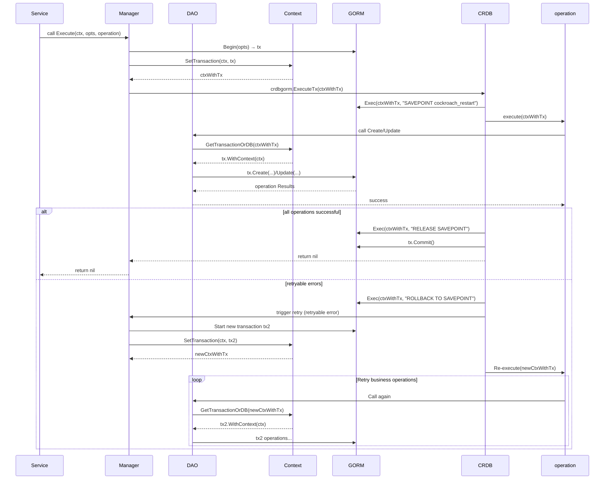

## 事务管理器

### 背景
在大部分业务场景中，项目大部分被划分为三层结构，也就是VCM，这里我们一般是:
* dao: 数据库增删改查
* service： 业务逻辑
* api/controller: api控制层


我们在业务中需要操作多张表，并且我们需要保证事务，你也不想在service直接```tx.Table().Create```这些操作吧，我们有没有办法在尽可能少的改动代码（或者不改动旧函数参数)
来实现事务功能？ 答案肯定是可以的，先梳理需求：
* 需要直接service业务层调用我们的dao层方法，来实现事务操作
* 事务自动提交或回滚
* 事务重试
* 最小代码改动

### 设计思路
结合需求第一点和最后一点，事务实例```tx```我们可以通过context的方式传入到dao层，然后dao层根据情况获取正常```db```还是事务```tx```，所以这里看到需要一个事务管理器来实现这个功能
然后事务需要自动提交或者回滚，事务重试，我们可以直接写，但是这里我们使用了```cockroachdb```开源的一个包，他实现了gorm, pgx, sqlx等事务，地址如下：
```
https://github.com/cockroachdb/cockroach-go
```
我们可以将cockroach-go下的crdb部分代码直接放到到我们自己的项目或者公共依赖中，到此为止我们4个需求都能满足了

### 实现
#### 目录结构
```
> tree .
.
├── README.md
├── context.go
├── crdb
│   ├── README.md
│   ├── common.go
│   ├── crdbgorm
│   │   ├── gorm.go
│   │   ├── gorm_test.go
│   ├── crdbpgx
│   │   ├── README.md
│   │   ├── pgx.go
│   │   ├── pgx_test.go
│   ├── crdbpgxv5
│   │   ├── README.md
│   │   ├── pgx.go
│   │   ├── pgx_test.go
│   ├── crdbsqlx
│   │   ├── sqlx.go
│   │   ├── sqlx_test.go
│   ├── error.go
│   ├── error_test.go
│   ├── testing_util.go
│   ├── tx.go
│   ├── tx_test.go
├── manager.go
└── manager_test.go
```

#### 示例
```go
func TestTransactionManager(t *testing.T) {
    // 初始化事务管理器（实际项目中应该从依赖注入获取）
    txManager := NewManager(db.GetMysqlConn(db.MYSQL_DB_HICHAT2))
    
    // 模拟用户ID和商品ID
    userID := uint(1)
    productID := uint(101)
    quantity := 2
    
    ctx := context.Background()
    err := txManager.Execute(ctx, nil, func(ctx context.Context) error {
        // 1. 扣减库存
        if err := DeductInventory(ctx, productID, quantity); err != nil {
            return fmt.Errorf("deduct inventory error: %w", err)
        }
        
        // 2. 创建订单
        if err := CreateOrder(ctx, userID, productID, quantity); err != nil {
            return fmt.Errorf("create order error: %w", err)
        }
        
        // 3. 从购物车移除
        if err := RemoveCartItems(ctx, userID, productID); err != nil {
            return fmt.Errorf("remove cart items error: %w", err)
        }
        
        return nil
	})
    if err != nil {
    t.Errorf("购买失败 执行事务失败: %s", err.Error())
        return
    }
    
    t.Log("购买成功!")
}
```

### 时序图

